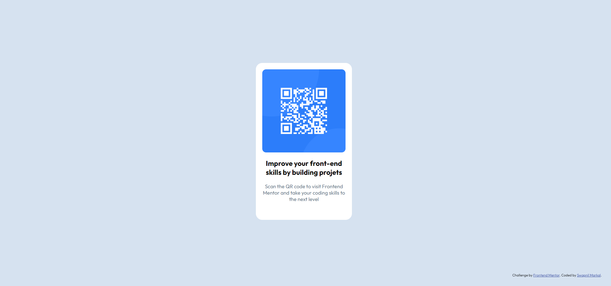

# Frontend Mentor - QR code component solution

This is a solution to the [QR code component challenge on Frontend Mentor](https://www.frontendmentor.io/challenges/qr-code-component-iux_sIO_H). Frontend Mentor challenges help you improve your coding skills by building realistic projects. 

## Table of contents

- [Overview](#overview)
  - [Screenshot](#screenshot)
  - [Links](#links)
- [My process](#my-process)
  - [Built with](#built-with)
  - [What I learned](#what-i-learned)
  - [Continued development](#continued-development)
- [Author](#author)

## Overview

### Screenshot

### Links

- Solution URL: [Github code](https://github.com/Cjmax10/qr-code-component)
- Live Site URL: [Live Site](https://cjmax10.github.io/qr-code-component/)

## My process

### Built with

- Semantic HTML5 markup
- CSS custom properties
- Flexbox

### What I learned

Created this challenge with Flexbox. Main focus was creating section as fast as possible.

### Continued development

Further focus would be web accessibility.

## Author

- Website - [Portfolio](https://cjmax10.github.io/Portfolio/)
- Frontend Mentor - [@Cjmax10](https://www.frontendmentor.io/profile/Cjmax10)